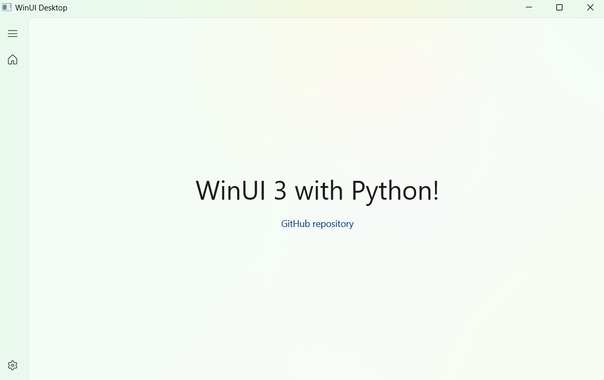

# Win32more

[](https://pypi.org/project/win32more)
[](https://pypi.org/project/win32more)

Win32more is a python bindings for Windows API generated from metadata.

https://github.com/microsoft/win32metadata

https://www.nuget.org/packages/Microsoft.Windows.SDK.Contracts

https://github.com/microsoft/WindowsAppSDK

## Description

This Python module provides a comprehensive interface for interacting with the Win32 API, allowing you to perform a wide range of operations and access system functionalities within the Windows environment. The `win32more` library facilitates interaction with Windows system components and applications through direct API calls, making it an invaluable tool for developers needing to interface with Windows at a low level.

`win32more` is a powerful replacement for older libraries and provides enhanced support for modern Windows versions and APIs. With this module, you can leverage the full capabilities of the Win32 API to create, manage, and manipulate system resources and applications with ease.

Whether you're building utilities, automating tasks, or developing advanced applications, `win32more` offers the flexibility and control you need.



### Example Usage of Win32more
```python
# winui.py
from win32more.xaml import XamlApplication
from win32more.Microsoft.UI.Xaml import Window
from win32more.Microsoft.UI.Xaml.Media import MicaBackdrop
from win32more.Microsoft.UI.Xaml.Markup import XamlReader

class App(XamlApplication):
    def OnLaunched(self, args):
        win = Window()
        win.SystemBackdrop = MicaBackdrop()
        with open("page.xaml", "r", encoding='utf-8') as file:
            win.Content = XamlReader.Load(file.read())
        win.Activate()

XamlApplication.Start(App)
```

```xml
<!-- page.xaml -->
<Page xmlns="http://schemas.microsoft.com/winfx/2006/xaml/presentation">
    <NavigationView IsBackButtonVisible="Collapsed">
        <NavigationView.MenuItems>
            <NavigationViewItem Content="Home" Icon="Home" />
        </NavigationView.MenuItems>
        <Frame>
            <StackPanel HorizontalAlignment="Center" VerticalAlignment="Center">
                <TextBlock Text="WinUI 3 with Python!" FontSize="40" Padding="10" HorizontalAlignment="Center" />
                <HyperlinkButton Content="GitHub repository" NavigateUri="https://github.com/ynkdir/py-win32more" HorizontalAlignment="Center" />
            </StackPanel>
        </Frame>
    </NavigationView>
</Page>
```

NOTE: This library requires a compatible Windows environment and appropriate permissions to access certain system functions.

## Installation

```bash
# Install Win32more Library
python -m pip install win32more
```

## Programming with Win32more

Let's build a simple app with `Win32more`. To begin, create an empty window and display it on the screen.
```python
from win32more.Microsoft.UI.Xaml import Window
from win32more.xaml import XamlApplication

class App(XamlApplication):
    def OnLaunched(self, args):
        win = Window()
        
        win.Activate()

XamlApplication.Start(App)
```

### Adding elements to the window

Now, add some elements to the window (don't forget to import them at the beginning of the script). To navigate into WinUI views and know from which library you've to import yours, take a look at the **WinUI 3 Gallery** app, avaible on Microsoft Store.

For example, the **Button** view belongs to `Microsoft.UI.Xaml.Controls`. Then import it as follows :
```python
from win32more.Microsoft.UI.Xaml import Window
from win32more.Microsoft.UI.Xaml.Controls import Button # Import Button view
from win32more.xaml import XamlApplication

class App(XamlApplication):
    def OnLaunched(self, args):
        win = Window()
        
        btn = Button() # Init Button instance
        btn.Content = "Hello World" # Set Button content
        
        win.Content = btn # Put it into the window
        win.Activate()

XamlApplication.Start(App)
```

### Handle (Button click) events

You'll probably want to run some code when you click on your button. Create a `ButtonClick` method to print "Hello World" in the console and link it to your button.
```python
from win32more.Microsoft.UI.Xaml import Window
from win32more.Microsoft.UI.Xaml.Controls import Button
from win32more.xaml import XamlApplication

class App(XamlApplication):
    def OnLaunched(self, args):
        win = Window()
        
        btn = Button()
        btn.Content = "Hello World"
        btn.add_Click(self.ButtonClick) # Link Button to method
        
        win.Content = btn
        win.Activate()
    
    def ButtonClick(self, sender, args): # Create method
        print("Hello World")

XamlApplication.Start(App)
```